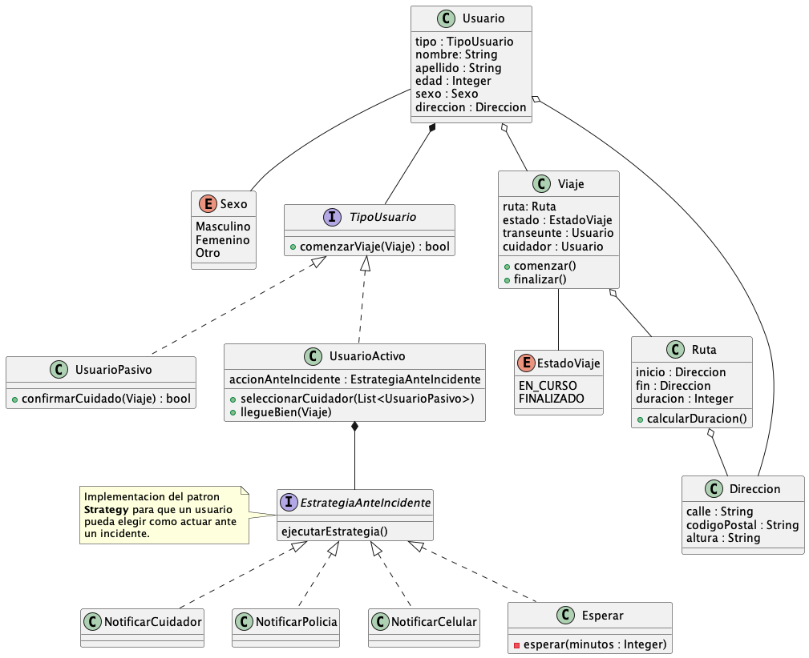

# Resumen de la practica

Para esta practica se realizaron los dos primeros punto de modelado de dominio
que figuran en la consigna. Estos figuran a continuacion:

## Punto 1
El diagrama de clases que modela el dominio para este punto:


## Punto 2
El diagrama de clases que modela el dominio para este punto:


### Cálculo de demora
Para explicar la solucion planteada en este punto se cuenta con este fragmento
de pseudocodigo.

```pseudocode
class calculoDemoraPorDefault implements EstrategiaDeCalculoDeDuracion {
        calcularDuracion(paradas : List<Parada>) : Integer{
            return calcularDuracionAproximada(paradas);
        }
  
        calcularDuracionAproximada(paradas : List<Parada>) : Integer{
            inicio = paradas.first()
            fin = paradas.last()
           
            return distanceApiMatrix.calcularDemora(inicio, fin);
        }
}

class calculoDemoraPorTramo implements EstrategiaDeCalculoDeDuracion {
    calcularDuracion(paradas : List<Parada>) : Integer{
        for each parada in paradas{
            demoraTotal += calcularDemoraPorTramo(paradas);
        }
        return demoraTotal;
    }
        
    calcularDemoraPorTramo(paradaA : Parada, paradaB : Parada) : Integer{
        return distanceApiMatrix.calcularDemora(paradaA, paradaB);
    }
}
```